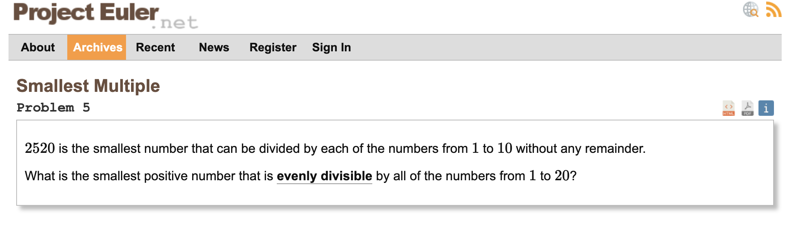
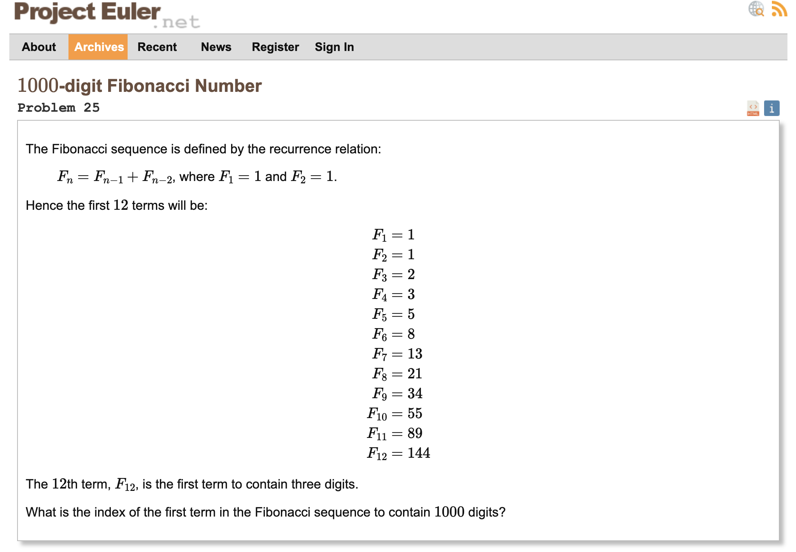

## лабораторная работа №1
## вариант 5, 25
### задание 5

### задание 25

### результат работы моей программы на языке Котлин
    введите число: 20
    НОК(1..20) = 18044195
    введите необходимое кол-во цифр числа Фибоначчи: 1000
    индекс первого числа Фибоначчи с заданным числом цифр: 4782
    
