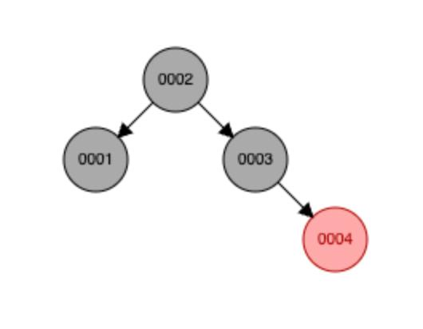
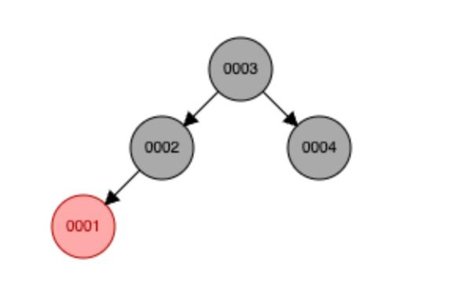

# лабораторная работа №2 реализация собственной структуры данных
## вариант RB-bag
#### выполнила: Пименова Екатерина, 409342

моей задачей было реализовать имплементацию интерфейса красно-черного дерева в такую структуру данных как бэг (мультисет). т.е. нодами красно-черного дерева у меня являются пары значений (число, количество вхождений). 

ну и пожалуйста, я решила это сделать

### структура красно-черного мульти-сета
в файле [`rb_bag_initialization.ml`](lib/rb_bag_initialization.ml) представлена сама модель узлов моего дерева:
 
    type color =
    | Red
    | Black

    type 'a rb_node =
    | Leaf
    | Node of {
      color : color;
      value : 'a * int; (** in case i implement multiset, i save value + its count*)
      left : 'a rb_node;
      right : 'a rb_node;
     }

вот. 

красно-черное дерево - один из видов самобалансирующегося дерева, которое после любого изменения своей структуры остается валидно. валидность красно-черного дерева = выполнение всех инвариантов. их всего четыре и функции для их проверки представлены в файле [`rb_bag_utils.ml`](lib/rb_bag_utils.ml):

    (* methods for checking all RBT invariants *)

    (** 1. the root of the tree must be black *)
    let check_root_is_black = function
    | Leaf -> true
    | Node { color; _ } -> color = Black

    (** 2. no red node has a red child *)
    let rec check_no_red_red = function
    | Leaf -> true
    | Node { color = Red; left; right; _ } ->
        (* if node is red, both children must be black *)
        color_of left = Black
        && color_of right = Black
        && check_no_red_red left
        && check_no_red_red right
    | Node { color = Black; left; right; _ } ->
        (* if node is black, recursively check children *)
        check_no_red_red left && check_no_red_red right

    (** 3. every path from the root to a leaf has the same number of black nodes =
        black height *)
    let check_black_height tree =
    (* helper function that returs None if black height is not the same for all
        paths, Some(height) otherwise *)
    let rec get_black_height = function
        | Leaf -> Some 1
        | Node { color; left; right; _ } ->
        (* recursively get heights of left and right subtrees *)
        ( match (get_black_height left, get_black_height right) with
        | (None, _) -> None
        | (_, None) -> None
        | (Some left_height, Some right_height) ->
            if left_height <> right_height then None
            else Some (left_height + if color = Black then 1 else 0) )
    in

    match get_black_height tree with
    | Some _ -> true
    | None -> false

    (* i am not checking the fact, that each node must have a color, because it is
    not possible to create a tree with invalid colors *)

    let is_tree_valid t =
    check_root_is_black t && check_no_red_red t && check_black_height t

если по русски:

1. каждый его узел либо красный, либо черный
2. его корень всегда черный
3. в дереве нет двух подряд идущих (назходящихся в отношении ребенок-родитель) красных узлов
4. количество черных узлов на пути к любому узлу одинаково. это величина называется **черной высотой** 

### публичное api

по условию лаборатной работы необходимо было реализовать интерфейс публичного апи моей структуры и вот же он в файле [`rb_bag.mli`](lib/rb_bag.mli)

    open Rb_bag_initialization

    type 'a t = 'a rb_node

    (* базовые операции с мультисетом *)
    val empty : 'a t (* пустое множ - нейтральный элемент моноида *)

    val is_empty : 'a t -> bool
    val size :
    'a t -> int (* кол-во элементов в мультисета сумма count_i по всем элементам*)
    val count : 'a -> 'a t -> int (* кол-во вхождений элемента в мультисете *)
    val unique_count :
    'a t ->
    int (* кол-во значений в мультисете (вне зависимости от числа повторений)*)
    val contains : 'a -> 'a t -> bool

    (* добавление/удаление *)
    val add : 'a -> 'a t -> 'a t
    val remove : 'a -> 'a t -> 'a t
    (* возвращает новый мультисет с удаленным вхождением [x]. если элемента нет,
    возвращает исходный. *)

    (* функц операции *)
    val filter : ('a -> bool) -> 'a t -> 'a t
    val map : ('a -> 'b) -> 'a t -> 'b t
    val fold_left : ('b -> 'a -> 'b) -> 'b -> 'a t -> 'b
    val fold_right : ('a -> 'b -> 'b) -> 'a t -> 'b -> 'b

    (* моноид *)

    val union :
    'a t ->
    'a t ->
    'a t (* объединяет два мультисета (ассоциативная операция моноида) *)

    (* утилиты *)
    val to_list :
    'a t -> 'a list (* каждый элемент повторяется согласно кратности *)
    val of_list : 'a list -> 'a t

    val equal : 'a t -> 'a t -> bool
    val compare : ('a -> 'a -> int) -> 'a t -> 'a t -> int
    val iter : ('a -> unit) -> 'a t -> unit

    val all : ('a -> bool) -> 'a t -> bool
    val any : ('a -> bool) -> 'a t -> bool

в целом тут комментарии излишни, кроме напоминания, что разработанная структура должна быть моноидом.

**моноид** - математическая структура, состоящая из:
* множества элементов
* бинарной операции
* нейтрального элемента

в моем случае бинарная ассоциативная операция - union - объединение двух rb-tree, а нейтральный элемент - empty, определенный как 

    let empty = Leaf

а, и кстати два дерева эквивалетны, если у них одинаковый набор элементов + у этих элементов одинаковые частоты. поскольку красно-черное дерево может иметь разную структуру, зависящую от порядка вставки элементов. например:

 

в моей реализации такие деревья равны.

### вставка в дерево

так. как я говорила, изменение красно-черного дерева должно оставлять его валидным.

*условия вставки элемента: 
новый элемент всегда красный.*

но как мы помним, есть инвариант, что в кчд не может быть двух подряд идущих красных узлов, поэтому приходится ему запускать балансировку.

есть две стратегии балансировки дерева после вставки:

* перекрашивание 
* поворот

выбор стратегии зависит от цвета ДЯДИ узла, который мы добавляем (дядя - брат родителя)

#### случай красного дяди
в этом случае достаточно перекрашивания всех узлов:

в [`main.ml`](bin/main.ml) приведены примеры, на которых демонстируются стратегии балансировки.

    > add 20:                           
    [black] (20, cnt=1)

    > add 10:
    [black] (20, cnt=1)
        └── left: [red] (10, cnt=1)

    > add 30:
    [black] (20, cnt=1)
        ├── left: [red] (10, cnt=1)
        └── right: [red] (30, cnt=1)

    > add 5:
    [black] (20, cnt=1)
        ├── left: [black] (10, cnt=1)
        │   └── left: [red] (5, cnt=1)
        └── right: [black] (30, cnt=1)

добавление первых трех элементов не нарушает инварианты, так что мы получаем просто дерево с черным корнем и двумя красными детьми.

но вот добавление элемента 5 (у которого красный дядя 30) **нарушает инвариант отсутствия двух красных подряд -> узлы перекрашиваются.** сначала все в противоположный цвет, потом корень окрашивается в черный (ведь корень КЧД всегда должен быть черным)

#### случай черного дяди

тут уже чуть сложнее, потому что простое перекрашивание приведет к нарушению черной высоты, так что используется перекрашивание + поворот.

    [black] (20, cnt=1)
        ├── left: [black] (10, cnt=1)
        │   └── left: [red] (5, cnt=1)
        └── right: [black] (30, cnt=1)

    > add 1:
    [black] (20, cnt=1)
        ├── left: [red] (5, cnt=1)
        │   ├── left: [black] (1, cnt=1)
        │   └── right: [black] (10, cnt=1)
        └── right: [black] (30, cnt=1)

у добавляемого узла 1 дядя 10 черный -> происходит перекрашивание и поворот. и родитель 1 5 становится корнем поддерева.

код балансировки после вставки:

    (** балансировка дерева после вставки элемента. обрабатывает случаи нарушения
        инвариантов Red-Black Tree:
        - если дядя красный: перекрашиваем узлы
        - если дядя черный: выполняем повороты *)
    let balance_after_insertion tree =
    match tree with
    (* 0. красный дядя слева - перекрашиваем *)
    | Node
        {
            color = Black;
            value = g;
            left =
            Node
                {
                color = Red;
                value = p;
                left = Node { color = Red; value = x; left = a; right = b };
                right = c;
                };
            right = Node { color = Red; value = u; left = d; right = e };
        } ->
        (* перекрашиваем: родитель и дядя становятся черными, дедушка красным *)
        Node
        {
            color = Red;
            value = g;
            left =
            Node
                {
                color = Black;
                value = p;
                left = Node { color = Red; value = x; left = a; right = b };
                right = c;
                };
            right = Node { color = Black; value = u; left = d; right = e };
        }
    (* красный дядя справа - перекрашиваем *)
    | Node
        {
            color = Black;
            value = g;
            left = Node { color = Red; value = u; left = d; right = e };
            right =
            Node
                {
                color = Red;
                value = p;
                left = c;
                right = Node { color = Red; value = x; left = a; right = b };
                };
        } ->
        (* перекрашиваем: родитель и дядя становятся черными, дедушка красным *)
        Node
        {
            color = Red;
            value = g;
            left = Node { color = Black; value = u; left = d; right = e };
            right =
            Node
                {
                color = Black;
                value = p;
                left = c;
                right = Node { color = Red; value = x; left = a; right = b };
                };
        }
    (* 1. left-left - левый ребенок левого ребенка красный (дядя черный) *)
    | Node
        {
            color = Black;
            value = g;
            left =
            Node
                {
                color = Red;
                value = p;
                left = Node { color = Red; value = x; left = a; right = b };
                right = c;
                };
            right = d;
        } ->
        (* поворот: поднимаем p наверх, делаем g и x черными *)
        Node
        {
            color = Red;
            value = p;
            left = Node { color = Black; value = x; left = a; right = b };
            right = Node { color = Black; value = g; left = c; right = d };
        }
    (* 2. left-right - правый ребенок левого ребенка красный *)
    | Node
        {
            color = Black;
            value = g;
            left =
            Node
                {
                color = Red;
                value = x;
                left = a;
                right = Node { color = Red; value = p; left = b; right = c };
                };
            right = d;
        } ->
        (* двойной поворот: сначала левый, потом правый *)
        Node
        {
            color = Red;
            value = p;
            left = Node { color = Black; value = x; left = a; right = b };
            right = Node { color = Black; value = g; left = c; right = d };
        }
    (* 3. right-right - правый ребенок правого ребенка красный (дядя черный) *)
    | Node
        {
            color = Black;
            value = x;
            left = a;
            right =
            Node
                {
                color = Red;
                value = p;
                left = b;
                right = Node { color = Red; value = g; left = c; right = d };
                };
        } ->
        (* поворот: поднимаем p наверх, делаем x и g черными *)
        Node
        {
            color = Red;
            value = p;
            left = Node { color = Black; value = x; left = a; right = b };
            right = Node { color = Black; value = g; left = c; right = d };
        }
    (* случай 4: right-left - левый ребенок правого ребенка красный *)
    | Node
        {
            color = Black;
            value = x;
            left = a;
            right =
            Node
                {
                color = Red;
                value = g;
                left = Node { color = Red; value = p; left = b; right = c };
                right = d;
                };
        } ->
        (* двойной поворот: сначала правый, потом левый *)
        Node
        {
            color = Red;
            value = p;
            left = Node { color = Black; value = x; left = a; right = b };
            right = Node { color = Black; value = g; left = c; right = d };
        }
    | t -> t

функция вставки:

    (** добавление элемента в мультисет. если элемент уже есть -> счетчик + 1. иначе
        -> вставляем новый узел + балансируем дерево *)
    let add x tree =
    (* вспомогательная функция рекурсивной вставки *)
    let rec insert = function
        (* если достигли листа, создаем новый красный узел *)
        | Leaf -> Node { color = Red; value = (x, 1); left = Leaf; right = Leaf }
        (* если элемент найден -> счетчик + 1 *)
        | Node { color; value = (v, count); left; right } when x = v ->
        Node { color; value = (v, count + 1); left; right }
        (* если элемент меньше текущего, идем влево *)
        | Node { color; value = (v, count); left; right } when x < v ->
        (* рекурсивно вставляем в левое поддерево и балансируем *)
        balance_after_insertion
            (Node { color; value = (v, count); left = insert left; right })
        (* если элемент больше текущего, идем вправо *)
        | Node { color; value = (v, count); left; right } ->
        (* рекурсивно вставляем в правое поддерево и балансируем *)
        balance_after_insertion
            (Node { color; value = (v, count); left; right = insert right })
    in
    let result = insert tree in
    match result with
    | Leaf -> Leaf
    | Node n -> Node { n with color = Black }

### удаление из дерева

ох, тут вообще все значительно тяжелее в отличие от вставки (есть 12 случаев удаления узла из КЧД). все их я расписывать не буду, но вот невероятная [статья](https://habr.com/ru/articles/573502/) с хабра, по которой я это изучала.

* в простых случаях (удаления листа/красного узла без детей) вообще ничего делать не нужно
* в случае наличия у узла всего одного ребенка, мы удаляем родителя и ставим на его места ребенка.
* а вот в случае наличия у узла двух детей, мы сначала ищем **преемника** (в моей реализации это самый маленький элемент в правом поддереве, но бывает и наоборот (max-left)). и преемник с удаляемым узлом меняются местами. удаление преемника сводится к задаче удаления узла с не более чем 1 ребенком

#### демонстрация некоторых случаев:

1. removing red leaf without rotation:

        before remove 5:
        [black] (20, cnt=1)
            ├── left: [black] (10, cnt=1)
            │   └── left: [red] (5, cnt=1)
            └── right: [black] (30, cnt=1)

        after remove 5:
        [black] (20, cnt=1)
            ├── left: [black] (10, cnt=1)
            └── right: [red] (30, cnt=1)

тут все просто и милашно

2. removing red node with red brother (needs recoloring):

        removing red node with red brother (needs recoloring):
        before remove 5:
        [black] (20, cnt=1)
            ├── left: [black] (10, cnt=1)
            │   ├── left: [red] (5, cnt=1)
            │   └── right: [red] (15, cnt=1)
            └── right: [black] (30, cnt=1)
                ├── left: [red] (25, cnt=1)
                └── right: [red] (35, cnt=1)

        after remove 5:
        [black] (20, cnt=1)
            ├── left: [black] (15, cnt=1)
            │   └── left: [black] (10, cnt=1)
            └── right: [red] (30, cnt=1)
                ├── left: [black] (25, cnt=1)
                └── right: [black] (35, cnt=1)

тут тоже нормально. удаляем 5 и перекрашиваем некоторые узлы, чтоб не нарушить черную высоту

removing node with two children (needs min-right successor):

    before remove 20 (root with two children):
    [black] (20, cnt=1)
        ├── left: [black] (10, cnt=1)
        │   ├── left: [red] (5, cnt=1)
        │   └── right: [red] (15, cnt=1)
        └── right: [red] (30, cnt=1)
            ├── left: [black] (25, cnt=1)
            │   ├── left: [red] (22, cnt=1)
            │   └── right: [red] (28, cnt=1)
            └── right: [black] (35, cnt=1)

    after remove 20 (min-right successor 22):
    [black] (22, cnt=1)
        ├── left: [black] (10, cnt=1)
        │   ├── left: [red] (5, cnt=1)
        │   └── right: [red] (15, cnt=1)
        └── right: [red] (30, cnt=1)
            ├── left: [black] (25, cnt=1)
            │   └── right: [red] (28, cnt=1)
            └── right: [black] (35, cnt=1)

а вот тут мы уже находим **преемника**. (для 20 это 22) и ставим его на место удаляемого элемента.

### тестирование

#### unit-tests - Alcotest

[`test_lab2.ml`](test/test_lab2.ml):

    open Lab2

    (* базовые операции *)
    let test_empty () =
    Alcotest.(check bool) "empty is empty" true (Rb_bag.is_empty Rb_bag.empty);
    Alcotest.(check int) "empty size is 0" 0 (Rb_bag.size Rb_bag.empty);
    Alcotest.(check int)
        "empty unique_count is 0" 0
        (Rb_bag.unique_count Rb_bag.empty)

    let test_size () =
    let bag = Rb_bag.of_list [ 1; 2; 2; 3; 3; 3 ] in
    Alcotest.(check int) "size counts all elements" 6 (Rb_bag.size bag);
    Alcotest.(check int)
        "unique_count counts unique elements" 3 (Rb_bag.unique_count bag)

    let test_count () =
    let bag = Rb_bag.of_list [ 1; 1; 1; 2; 2; 3 ] in
    Alcotest.(check int) "count of 1" 3 (Rb_bag.count 1 bag);
    Alcotest.(check int) "count of 2" 2 (Rb_bag.count 2 bag);
    Alcotest.(check int) "count of 3" 1 (Rb_bag.count 3 bag);
    Alcotest.(check int) "count of non-existent" 0 (Rb_bag.count 5 bag)

    let test_contains () =
    let bag = Rb_bag.of_list [ 1; 2; 2; 3 ] in
    Alcotest.(check bool) "contains existing element" true (Rb_bag.contains 2 bag);
    Alcotest.(check bool) "contains non-existent" false (Rb_bag.contains 5 bag)

    (** добавление и удаление *)
    let test_add () =
    let bag = Rb_bag.add 1 Rb_bag.empty in
    Alcotest.(check bool) "not empty after add" false (Rb_bag.is_empty bag);
    Alcotest.(check int) "size after add" 1 (Rb_bag.size bag);
    Alcotest.(check int) "count of added element" 1 (Rb_bag.count 1 bag);
    (* проверка инвариантов после добавления *)
    Alcotest.(check bool)
        "tree valid after add" true
        (Rb_bag_utils.is_tree_valid bag);
    let bag2 = Rb_bag.add 1 bag in
    Alcotest.(check int) "size after duplicate add" 2 (Rb_bag.size bag2);
    Alcotest.(check int) "count after duplicate add" 2 (Rb_bag.count 1 bag2);
    Alcotest.(check bool)
        "tree valid after duplicate add" true
        (Rb_bag_utils.is_tree_valid bag2);
    let bag3 = Rb_bag.add 2 bag2 in
    Alcotest.(check int) "size after add different" 3 (Rb_bag.size bag3);
    Alcotest.(check int) "count of new element" 1 (Rb_bag.count 2 bag3);
    Alcotest.(check bool)
        "tree valid after add different" true
        (Rb_bag_utils.is_tree_valid bag3)

    (** проверка инвариантов после множественных добавлений *)
    let test_add_invariants () =
    let bag = ref Rb_bag.empty in
    (* добавляем много элементов в разном порядке *)
    let elements = [ 5; 3; 7; 1; 9; 2; 8; 4; 6; 10 ] in
    List.iter
        (fun x ->
        bag := Rb_bag.add x !bag;
        Alcotest.(check bool)
            ("tree valid after adding " ^ string_of_int x)
            true
            (Rb_bag_utils.is_tree_valid !bag) )
        elements;
    (* добавляем дубликаты *)
    let duplicates = [ 5; 5; 3; 3; 7; 1 ] in
    List.iter
        (fun x ->
        bag := Rb_bag.add x !bag;
        Alcotest.(check bool)
            ("tree valid after adding duplicate " ^ string_of_int x)
            true
            (Rb_bag_utils.is_tree_valid !bag) )
        duplicates

    let test_remove () =
    let bag = Rb_bag.of_list [ 1; 1; 2; 3 ] in

    Alcotest.(check bool)
        "tree valid before remove" true
        (Rb_bag_utils.is_tree_valid bag);
    let bag' = Rb_bag.remove 1 bag in
    Alcotest.(check int) "count after remove" 1 (Rb_bag.count 1 bag');
    Alcotest.(check int) "size after remove" 3 (Rb_bag.size bag');
    Alcotest.(check bool)
        "tree valid after remove" true
        (Rb_bag_utils.is_tree_valid bag');
    let bag'' = Rb_bag.remove 1 bag' in
    Alcotest.(check int) "count after second remove" 0 (Rb_bag.count 1 bag'');
    Alcotest.(check int) "size after second remove" 2 (Rb_bag.size bag'');
    Alcotest.(check bool)
        "tree valid after second remove" true
        (Rb_bag_utils.is_tree_valid bag'');
    let bag''' = Rb_bag.remove 5 bag'' in
    Alcotest.(check int)
        "remove non-existent doesn't change size" 2 (Rb_bag.size bag''');
    Alcotest.(check bool)
        "tree valid after remove non-existent" true
        (Rb_bag_utils.is_tree_valid bag''');

    let bag'''' = Rb_bag.remove 3 bag''' in
    Alcotest.(check int) "remove elem 3 changed size" 1 (Rb_bag.size bag'''');
    Alcotest.(check bool)
        "tree valid after remove elem 3" true
        (Rb_bag_utils.is_tree_valid bag'''')

    (** функциональные операции *)
    let test_filter () =
    let bag = Rb_bag.of_list [ 1; 2; 2; 3; 4; 4; 4 ] in
    let filtered = Rb_bag.filter (fun x -> x mod 2 = 0) bag in
    Alcotest.(check int) "filter even numbers count 2" 2 (Rb_bag.count 2 filtered);
    Alcotest.(check int) "filter even numbers count 4" 3 (Rb_bag.count 4 filtered);
    Alcotest.(check int) "filter removes odd numbers" 0 (Rb_bag.count 1 filtered);
    Alcotest.(check int)
        "filter removes odd numbers 3" 0 (Rb_bag.count 3 filtered);
    let all_filtered = Rb_bag.filter (fun _ -> false) bag in
    Alcotest.(check bool)
        "filter all false returns empty" true
        (Rb_bag.is_empty all_filtered)

    let test_map () =
    let bag = Rb_bag.of_list [ 1; 2; 2; 3 ] in
    let mapped = Rb_bag.map (fun x -> x * 2) bag in
    (* после map (fun x -> x * 2) на [1; 2; 2; 3] должно быть [2; 4; 4; 6] *)
    (* поэтому count 2 = 1, count 4 = 2, count 6 = 1 *)
    Alcotest.(check int) "map doubles count of 2" 1 (Rb_bag.count 2 mapped);
    Alcotest.(check int) "map doubles count of 4" 2 (Rb_bag.count 4 mapped);
    Alcotest.(check int) "map doubles count of 6" 1 (Rb_bag.count 6 mapped);
    Alcotest.(check int) "map preserves size" 4 (Rb_bag.size mapped)

    let test_fold_left () =
    let bag = Rb_bag.of_list [ 1; 2; 2; 3 ] in
    let sum = Rb_bag.fold_left ( + ) 0 bag in
    Alcotest.(check int) "fold_left sum" 8 sum;
    let product = Rb_bag.fold_left ( * ) 1 bag in
    Alcotest.(check int) "fold_left product" 12 product;
    let count_even =
        Rb_bag.fold_left (fun acc x -> if x mod 2 = 0 then acc + 1 else acc) 0 bag
    in
    Alcotest.(check int) "fold_left count even" 2 count_even

    let test_fold_right () =
    let bag = Rb_bag.of_list [ 1; 2; 2; 3 ] in
    let sum = Rb_bag.fold_right ( + ) bag 0 in
    Alcotest.(check int) "fold_right sum" 8 sum;
    let list = Rb_bag.fold_right (fun x acc -> x :: acc) bag [] in
    Alcotest.(check (list int)) "fold_right to list" [ 1; 2; 2; 3 ] list

    (** моноид *)
    let test_union () =
    let a = Rb_bag.of_list [ 1; 2; 2 ] in
    let b = Rb_bag.of_list [ 2; 3 ] in
    let c = Rb_bag.union a b in
    Alcotest.(check int) "union count of 1" 1 (Rb_bag.count 1 c);
    Alcotest.(check int) "union count of 2" 3 (Rb_bag.count 2 c);
    Alcotest.(check int) "union count of 3" 1 (Rb_bag.count 3 c);
    let empty_union = Rb_bag.union Rb_bag.empty a in
    Alcotest.(check int) "union with empty preserves" 3 (Rb_bag.size empty_union);
    let union_empty = Rb_bag.union a Rb_bag.empty in
    Alcotest.(check int) "union empty preserves" 3 (Rb_bag.size union_empty);
    (* проверка идентичности (рефлексивности) *)
    Alcotest.(check bool) "union empty a = a" true (Rb_bag.equal empty_union a);
    Alcotest.(check bool) "union a empty = a" true (Rb_bag.equal union_empty a);
    (* проверка ассоциативности *)
    let d = Rb_bag.of_list [ 4; 5; 5 ] in
    let left_assoc = Rb_bag.union (Rb_bag.union a b) d in
    let right_assoc = Rb_bag.union a (Rb_bag.union b d) in
    Alcotest.(check bool)
        "union is associative: (a union b) union d = a union (b union d)" true
        (Rb_bag.equal left_assoc right_assoc)

    (** утилиты *)
    let test_to_list () =
    let bag = Rb_bag.of_list [ 1; 2; 2; 3 ] in
    let lst = Rb_bag.to_list bag in
    Alcotest.(check (list int)) "to_list contains all elements" [ 1; 2; 2; 3 ] lst;
    let empty_lst = Rb_bag.to_list Rb_bag.empty in
    Alcotest.(check (list int)) "to_list empty is empty" [] empty_lst

    let test_of_list () =
    let bag = Rb_bag.of_list [ 3; 1; 2; 2; 1 ] in
    Alcotest.(check int) "of_list count 1" 2 (Rb_bag.count 1 bag);
    Alcotest.(check int) "of_list count 2" 2 (Rb_bag.count 2 bag);
    Alcotest.(check int) "of_list count 3" 1 (Rb_bag.count 3 bag);
    Alcotest.(check int) "of_list size" 5 (Rb_bag.size bag);
    Alcotest.(check bool)
        "created tree is valid" true
        (Rb_bag_utils.is_tree_valid bag)

    let test_iter () =
    let bag = Rb_bag.of_list [ 1; 2; 3 ] in
    let acc = ref [] in
    Rb_bag.iter (fun x -> acc := x :: !acc) bag;
    Alcotest.(check (list int)) "iter collects all elements" [ 3; 2; 1 ] !acc

    let test_all () =
    let bag = Rb_bag.of_list [ 2; 4; 6; 8 ] in
    Alcotest.(check bool)
        "all even returns true" true
        (Rb_bag.all (fun x -> x mod 2 = 0) bag);
    Alcotest.(check bool)
        "all > 10 returns false" false
        (Rb_bag.all (fun x -> x > 10) bag);
    let empty_all = Rb_bag.all (fun _ -> false) Rb_bag.empty in
    Alcotest.(check bool) "all on empty returns true" true empty_all

    let test_any () =
    let bag = Rb_bag.of_list [ 1; 3; 5; 7 ] in
    Alcotest.(check bool)
        "any even returns false" false
        (Rb_bag.any (fun x -> x mod 2 = 0) bag);
    Alcotest.(check bool)
        "any > 5 returns true" true
        (Rb_bag.any (fun x -> x > 5) bag);
    let empty_any = Rb_bag.any (fun _ -> true) Rb_bag.empty in
    Alcotest.(check bool) "any on empty returns false" false empty_any

базовые юнит-тесты

#### property-based testing - QCheck

в комментариях тестов подробно описаны свойства, которыми обладает мое дерево. тестирование проводится с использованием генератора списка целых чисел из которого методов of_list создается дерево

[`test_properties.ml`](test/test_properties.ml):

    open Lab2
    open Rb_bag

    let int_list_arb = QCheck.(list int)
    let int_arb = QCheck.int

    (* свойтсво 1: моноид - ассоциативность union (a union b) union c = a union (b
    union c)*)
    let prop_union_assoc =
    QCheck.Test.make ~name:"union is associative"
        QCheck.(triple int_list_arb int_list_arb int_list_arb)
        (fun (a, b, c) ->
        let bag_a = of_list a in
        let bag_b = of_list b in
        let bag_c = of_list c in
        let left = union (union bag_a bag_b) bag_c in
        let right = union bag_a (union bag_b bag_c) in
        equal left right )

    (* свойство 2: моноид содержит нейтральный элемент empty union a = a union empty
    = a *)
    let prop_union_empty =
    QCheck.Test.make ~name:"empty is identity for union" int_list_arb (fun lst ->
        let bag = of_list lst in
        let left = union empty bag in
        let right = union bag empty in
        equal left bag && equal right bag )

    (* свойство 3: добавление и удаление одного и то же элемента обратны count x bag
    = count x remove x add x bag*)
    let prop_add_remove =
    QCheck.Test.make ~name:"add and remove are inverse"
        QCheck.(pair int_list_arb int_arb)
        (fun (lst, x) ->
        let bag = of_list lst in
        count x (remove x (add x bag)) = count x bag )

    (* свойство 4: размер увеличивается на 1 после добавления size(add(x, bag)) =
    size(bag) + 1*)
    let prop_size_add =
    QCheck.Test.make ~name:"size increases by 1 after add"
        QCheck.(pair int_list_arb int_arb)
        (fun (lst, x) ->
        let bag = of_list lst in
        size (add x bag) = size bag + 1 )

    (* свойство 5: размер уменьшается на 1 после удаления существующего элемента
    size(remove(x, bag)) = size(bag) - 1 и не изменяется при попытке удаления
    несущ. в bag*)
    let prop_size_remove =
    QCheck.Test.make ~name:"size decreases by 1 after remove existing"
        QCheck.(pair int_list_arb int_arb)
        (fun (lst, x) ->
        let bag = of_list lst in

        let size_before = size bag in
        let bag' = remove x bag in
        if contains x bag then size bag' = size_before - 1
        else size bag' = size_before )

    (* свойство 6: сохранение размера при map map не меняет количество элементов,
    только их значения size(map(f, bag)) = size(bag)*)
    let prop_map_preserves_size =
    QCheck.Test.make ~name:"map preserves size" int_list_arb (fun lst ->
        let bag = of_list lst in
        size (map (fun x -> x * 2) bag) = size bag )

    (* свойство 7: фильтрация уменьшает или сохраняет размер size(filter(p, bag)) <=
    size(bag)*)
    let prop_filter_size =
    QCheck.Test.make ~name:"filter size is less or equal" int_list_arb (fun lst ->
        let bag = of_list lst in
        size (filter (fun x -> x mod 2 = 0) bag) <= size bag )

    (* свойство 8: count после добавления увеличивается на 1 count(x, add(x, bag)) =
    count(x, bag) + 1*)
    let prop_count_add =
    QCheck.Test.make ~name:"count increases by 1 after add"
        QCheck.(pair int_list_arb int_arb)
        (fun (lst, x) ->
        let bag = of_list lst in
        count x (add x bag) = count x bag + 1 )

    (* свойство 9: count после удаления уменьшается на 1 (если элемент был) если
    count(x, bag) > 0, то count(x, remove(x, bag)) = count(x, bag) - 1*)
    let prop_count_remove =
    QCheck.Test.make ~name:"count decreases by 1 after remove"
        QCheck.(pair int_list_arb int_arb)
        (fun (lst, x) ->
        let bag = of_list lst in
        let count_before = count x bag in
        let bag' = remove x bag in
        if count_before > 0 then count x bag' = count_before - 1
        else count x bag' = 0 )

    (* дерево остается валидным после add, remove, union, map*)
    let prop_tree_valid_after_add =
    QCheck.Test.make ~name:"tree valid after add"
        QCheck.(pair int_list_arb int_arb)
        (fun (lst, x) ->
        let bag = of_list lst in
        Rb_bag_utils.is_tree_valid (add x bag) )

    let prop_tree_valid_after_remove =
    QCheck.Test.make ~name:"tree valid after remove"
        QCheck.(pair int_list_arb int_arb)
        (fun (lst, x) ->
        let bag = of_list lst in
        Rb_bag_utils.is_tree_valid (remove x bag) )

    let prop_tree_valid_after_union =
    QCheck.Test.make ~name:"tree valid after union"
        QCheck.(pair int_list_arb int_list_arb)
        (fun (a, b) ->
        let bag_a = of_list a in
        let bag_b = of_list b in
        Rb_bag_utils.is_tree_valid (union bag_a bag_b) )

    let prop_tree_valid_after_map =
    QCheck.Test.make ~name:"tree valid after map" int_list_arb (fun lst ->
        let bag = of_list lst in
        let mapped = map (fun x -> x * 2) bag in
        Rb_bag_utils.is_tree_valid mapped )

    (* свойствао 11: fold_left и fold_right дают идентичный результат для
    коммутативных операций (типа сложения)*)
    let prop_fold_commutative =
    QCheck.Test.make ~name:"fold_left and fold_right same for commutative ops"
        int_list_arb (fun lst ->
        let bag = of_list lst in
        fold_left ( + ) 0 bag = fold_right ( + ) bag 0
        && fold_left ( * ) 1 bag = fold_right ( * ) bag 1 )

    (* свойство 12: to_list и of_list сохраняют размер и содержимое (порядок и цвета
    могут отличаться)*)
    let prop_to_list_of_list =
    QCheck.Test.make ~name:"to_list and of_list preserve size and content"
        int_list_arb (fun lst ->
        let bag = Rb_bag.of_list lst in
        let lst' = Rb_bag.to_list bag in
        (* Проверяем, что размер совпадает *)
        List.length lst' = Rb_bag.size bag
        &&
        (* Проверяем, что для каждого элемента количество совпадает *)
        List.for_all
            (fun x ->
            let count_original = List.length (List.filter (( = ) x) lst) in
            let count_result = List.length (List.filter (( = ) x) lst') in
            count_original = count_result )
            (List.sort_uniq Stdlib.compare lst) )

    let () =
    QCheck_runner.run_tests_main
        [
        (* Моноид свойства *)
        prop_union_assoc;
        prop_union_empty;
        (* Базовые операции *)
        prop_add_remove;
        prop_size_add;
        prop_size_remove;
        prop_count_add;
        prop_count_remove;
        (* Функциональные операции *)
        prop_map_preserves_size;
        prop_filter_size;
        prop_fold_commutative;
        prop_to_list_of_list;
        (* Валидность дерева *)
        prop_tree_valid_after_add;
        prop_tree_valid_after_remove;
        prop_tree_valid_after_union;
        (* prop_tree_valid_after_filter; - временно отключен из-за упрощенной
            балансировки *)
        prop_tree_valid_after_map;
        ]

мне очень нравятся PBT они очень умные и добрые

### выводы
в ходе выполнения данной лабораторной работы я изучила создание своих структур данных в языке окамль, познакомилась с полиморфизмом и интерфейсами в нем. также изучила проперти-бейзд тестирование. 

мне очень понравилось выполнение этой работы, ведь я наконец-то разобралась с такой структурой, как красно-черное дерево!!! пускай я и не идеально осознаю все сценарии удаления узлов, понимания явно очень сильно прибавилось. 

ну и как сказала alena это лаба действительно напоминает о светлых временах на продмате, что добавляет ей обаяния (лабе тоже). 😊